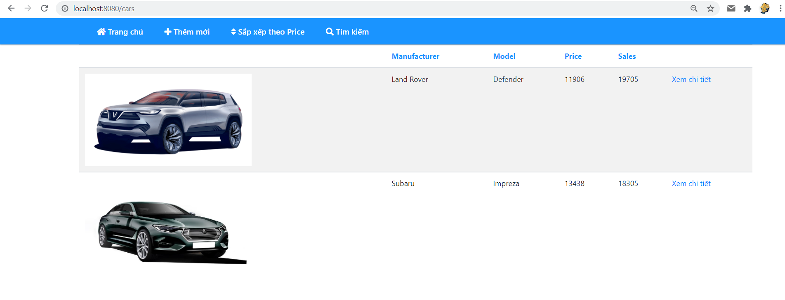

## Project car sử dụng thymeleaf
### Bước 1: Tạo 1 project mới
+ Tạo thư mục `model`: file `Car.java` để tạo class Car với các thuộc tính: id, model, manufacturer, price, sales, photos
+ Thư mục `repository` gồm 2 file `Dao.java` để tạo các công việc cần xử lý, file `CarRepository.java` extends abstract `Dao` để xử lý các logic
+ Thư mục `controller` gồm file `CarController.java` để tạo ra các URL trả về file HTML ở thư mục `resources/templates`
### Bước 2: Check hiển thị trên web
2.1. Trang chủ hiển thị list cars:

2.2. Ấn vào link xem chi tiết để hiển thị chi tiết 1 car

2.3. Tại giao diện 1 car, có thể chọn edit hoặc delete car
+ Giao diện edit car

+ Ví dụ thử sửa manufacturer thành `Chevrolet-update`, ấn save, kết quả sẽ là:

+ Tiếp tục ấn vào xem chi tiết của `Chevrolet-update`, chọn `Delete car`, kết quả sẽ là:

2.4. Tại trang chủ, chọn `Thêm mới` sẽ hiện ra form như bên dưới:

Điền các trường, lần lượt là: `xe mới, xe mới, 1000, 2000`, ấn `save` sẽ nhận được kết quả là

2.5. Ấn vào nút tìm kiếm trên thanh công cụ, giao diện sẽ hiện ra như bên dưới:

Nhập thử chữ `a`, kết quả sẽ hiện ra:

2.6. Quay lại trang chủ, chọn `sắp xếp theo price`, sản phẩm sẽ được sắp xếp lại theo price từ thấp đến cao:
