# Getting Started

### Cấu trúc thư mục

Tạo các folder và file với cấu trúc thư mục như bên dưới.

### Test kết quả:

#### 1. Trang chủ

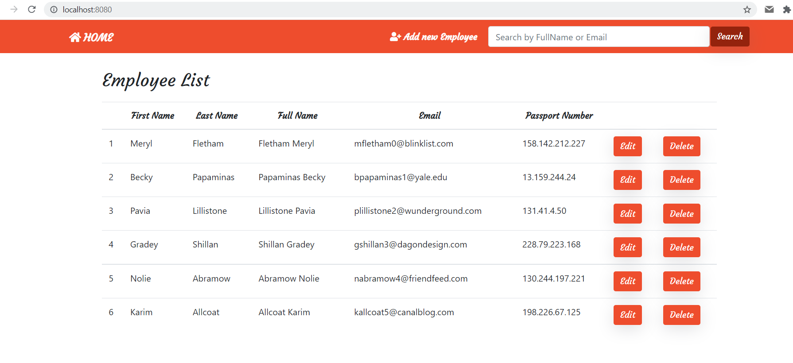

#### 2. Tìm kiếm theo ID, nhập vào đường dẫn như trong ảnh (id tùy chọn)

* Trường hợp ID đúng:
  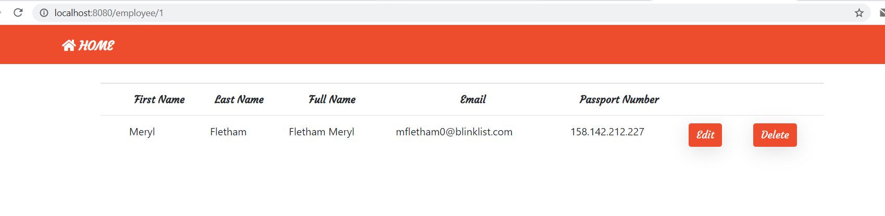
* Trường hợp ID sai:
  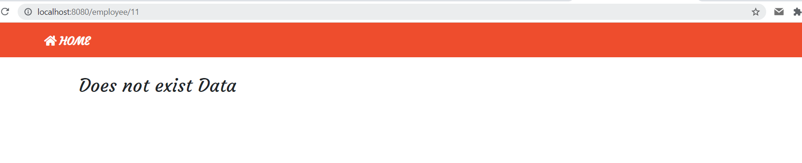

#### 3. Thêm dữ liệu mới

* Kích vào mục add new employee, sẽ hiện ra form để thêm dữ liệu:
  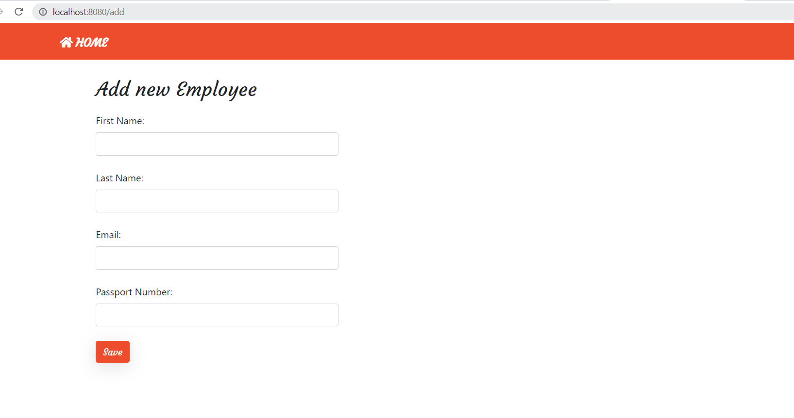
* Nhập vào dữ liệu cần thêm mới:
  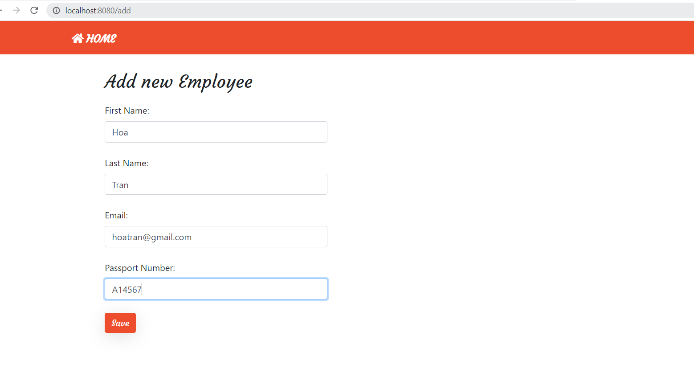
* Sau khi nhập xong, ấn save sẽ tự động chuyển về trang home, kết quả
  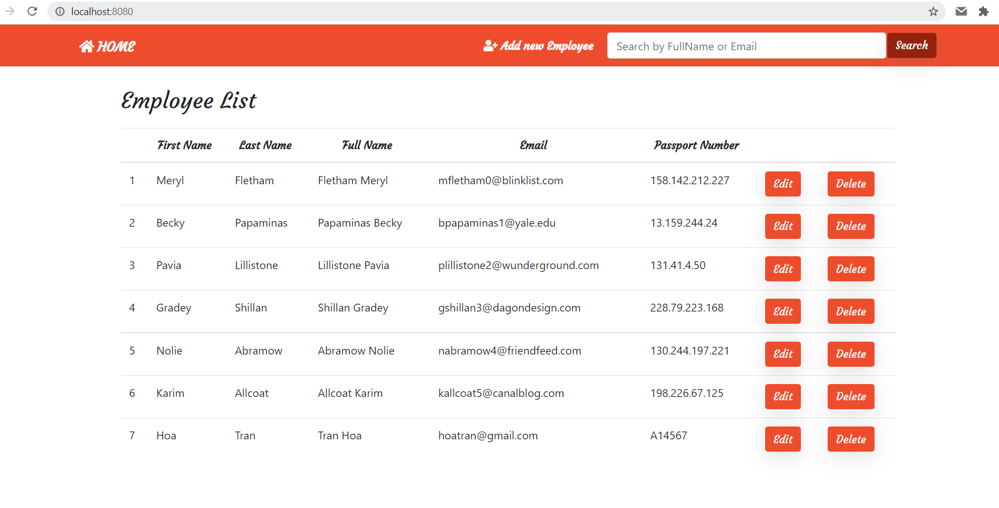

#### 4. Sửa dữ liệu

* Kích vào `Edit` tương ứng hàng dữ liệu cần sửa, sẽ hiện ra form như bên dưới, ví dụ chọn `Meryl`
  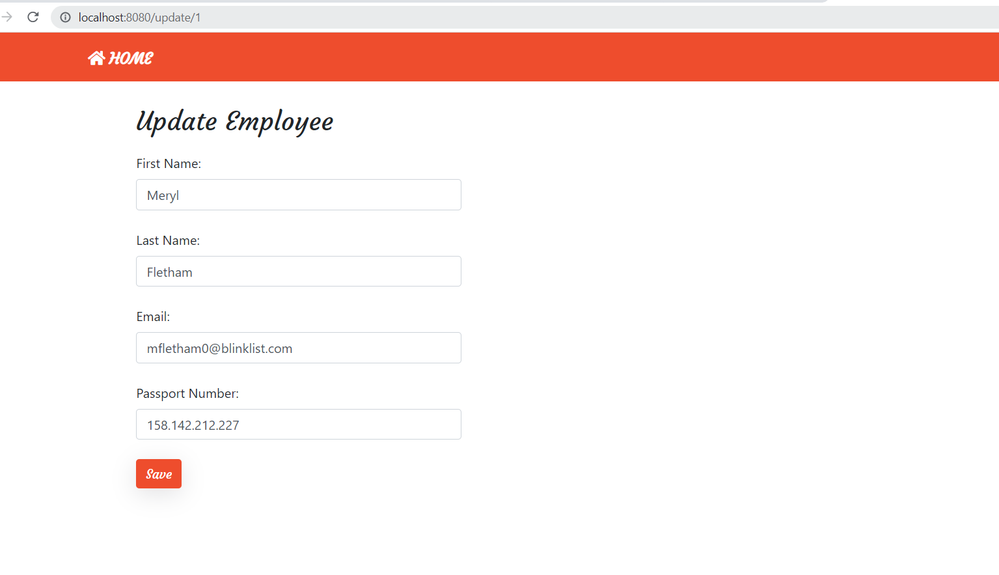
* Sau khi edit vài trường, ấn nút `save`, kết quả:
  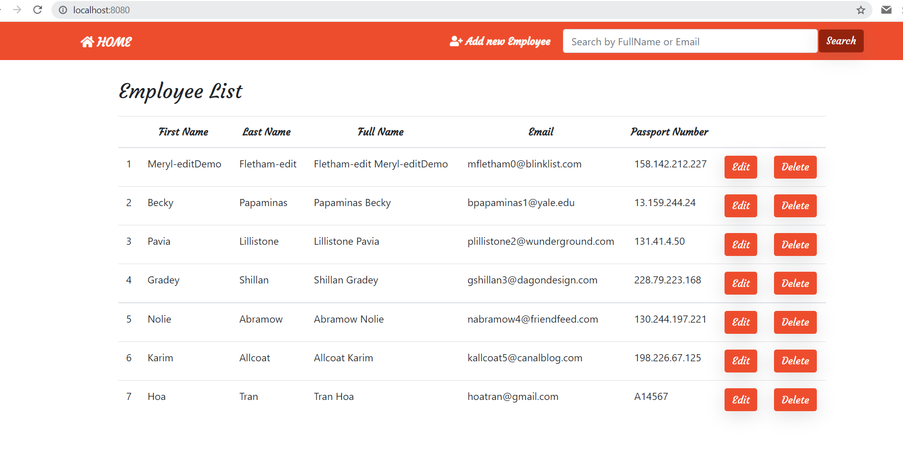

#### 5. Xóa dữ liệu

* Kích vào nút `Delete` tương ứng hàng dữ liệu cần xóa, ví dụ muốn xóa hàng đầu tiên `Meryl-editDemo`, sẽ được kết quả:
  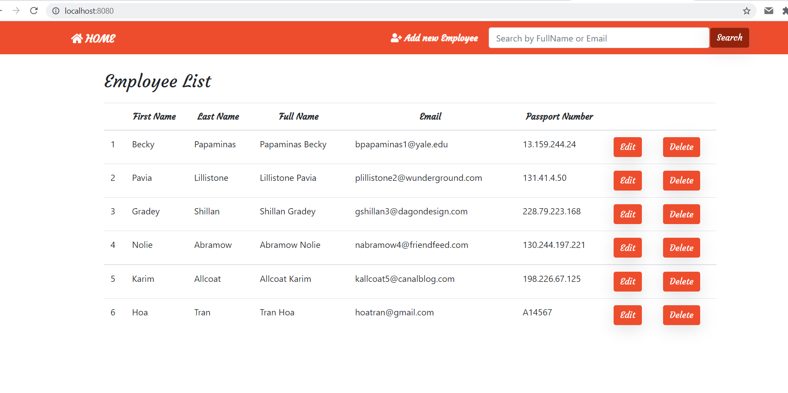

#### 6. Tìm kiếm dự theo fullName và email

* Nhập thông tin cần tìm kiếm vào ô input:
  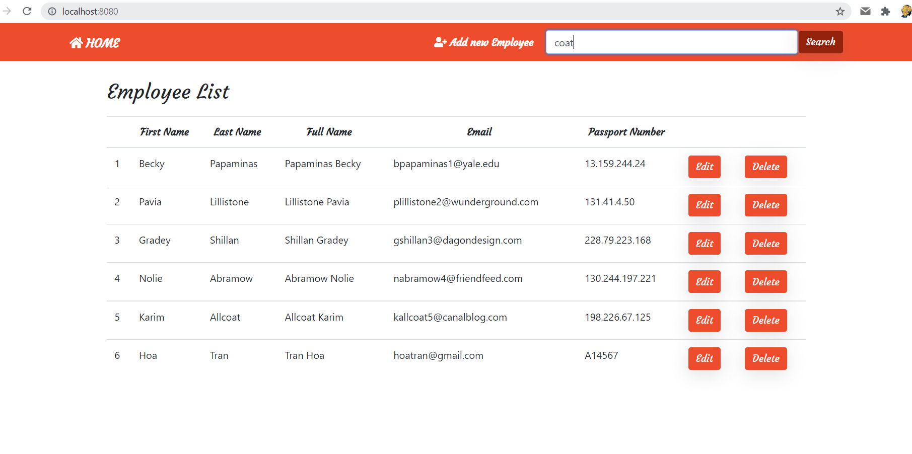
* Sau đó nhấn nút `Search`, kết quả hiện ra:
  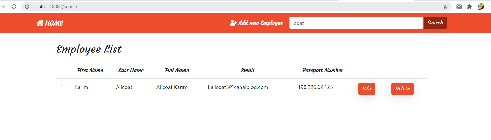

